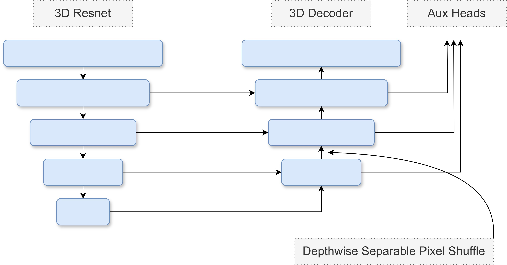
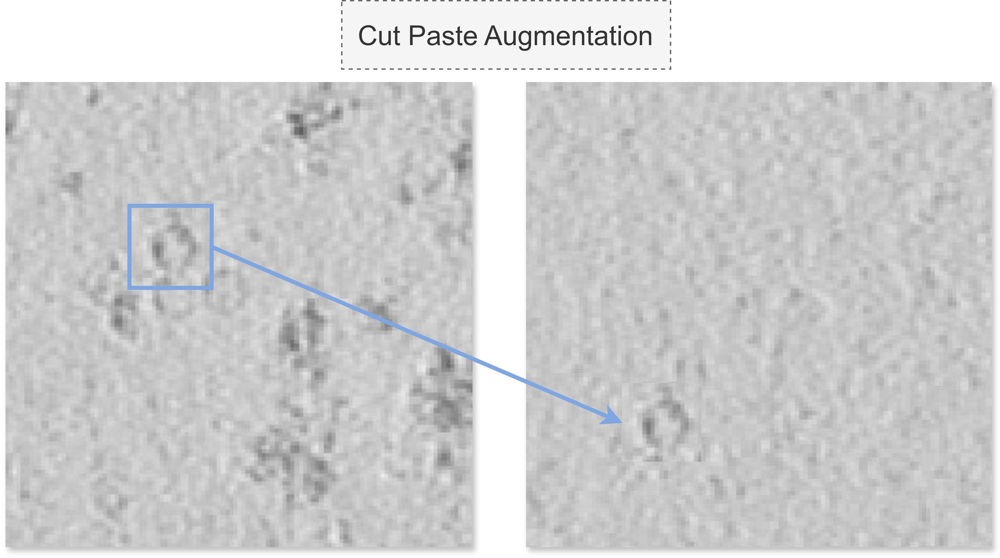

## 13th Place Solution

Note: This repository contains the 13th place solution in the CZII - CryoET Object Identification Competition. 

Kaggle write-up: [here](https://www.kaggle.com/competitions/rsna-2024-lumbar-spine-degenerative-classification/discussion/539452)

Thanks to CZII and Kaggle for hosting this competition, it was a fun one and I learned a lot. Also thanks to the hosts for actively contributing to the forums, this was very helpful for participants.

TLDR; My solution uses 3D unet models only. Each model uses a pre-trained resnet3d encoder from [3D-ResNets-PyTorch](https://github.com/kenshohara/3D-ResNets-PyTorch), and a decoder with pixel shuffle upsample blocks. I apply EMA, heavy augmentations, and other regularization strategies to improve generalization.

## Model

<h1 align="center">

</h1>

My final submission uses 2x r3d50, 2x r3d34 and 1x r3d18 backbones. The deeper encoders perform better on CV and LB, but an ensemble of all three works best. The encoders are improved by adding [Stochastic Depth](https://arxiv.org/abs/1603.09382) and [DropBlock](https://arxiv.org/abs/1810.12890).

In the decoder, I use standard pixel shuffle in all layers except the deepest layer. In the deepest layer, I replace the conv3d in pixel shuffle with a depth-wise separable 3D convolution. This significantly reduces the parameter count of the decoder with no drop in performance. Applying this modification to shallower blocks did reduce performance.

I use 3 auxiliary segmentation heads to regularize the intermediate feature maps. The heads are trained on the max pooled segmentation masks rather than interpolated masks. This was done to force more “confidence” into the intermediate features.

Each model is trained in 2 stages. In the first stage, I freeze the encoder and train the decoder on the simulated data. In the second stage, I unfreeze all parameters and train on the competition data.

## Augs

Heavy augmentations are very important in this pipeline. I apply cut mix, rotation, flips, pixel intensity, and pixel shift to each batch with 100% probability. 

<h1 align="center">

</h1>

Another augmentation I use is cut paste. For this augmentation, I crop around each picked particle center and randomly insert them into patches with no picked particles. It works well to apply this augmentation within the same volume, but it was not beneficial to cut paste between volumes.

## Inference

During inference, I use Monai’s [sliding_window_inference](https://docs.monai.io/en/latest/inferers.html#sliding-window-inference-function) function to iterate patches. Based on the visualization of OOF predictions locally, I found that a high degree of overlap (eg. 0.5+) helped reduce uncertainty on the edge of patches. Moreover, on a (32, 128, 128) patch I only made predictions on the central (16, 64, 64) pixels. This increased the inference time significantly but improved CV and LB by ~0.005.

## Final Note

On the final day of the competition, I realized that my segmentation masks and coordinate conversion code were incorrect! With no time to retrain models, my final submissions attempted corrected this with postprocessing. These submissions were my highest-scoring, and I learned a valuable lesson for next time 🙂

Thanks to everyone for sharing throughout. Happy Kaggling!

## Run 

As I am out of the prize zone I will not provide detailed reproducability instructions. If you have any questions feel free to reach out to me directly. Cheers.